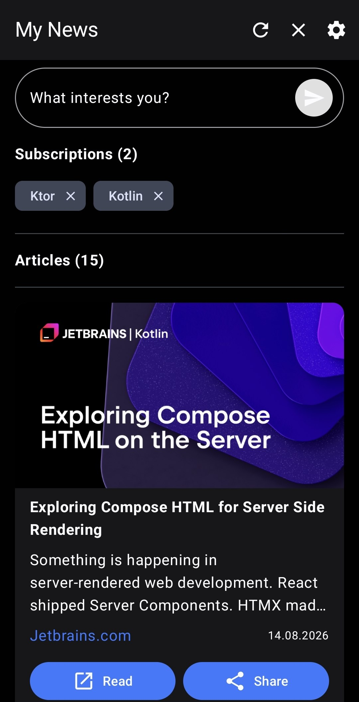
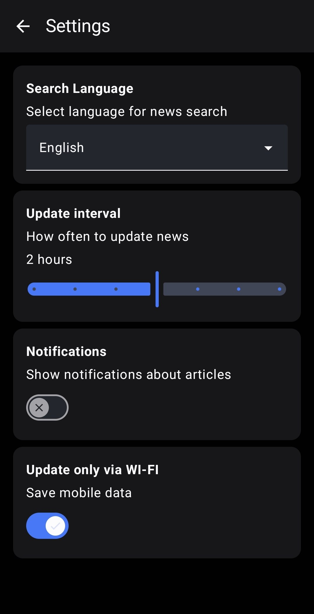

# News App

A modern Android news application built with Jetpack Compose. Search articles by keyword, manage your favorite topics, and read full articles — all with a clean Material 3 UI and offline support.

## Screenshots

<p>
  
  
  
</p>

## Tech Stack

- **Language:** Kotlin
- **UI:** Jetpack Compose, Material 3, SplashScreen API
- **Architecture:** Clean Architecture + MVVM
- **DI:** Hilt
- **Navigation:** Jetpack Navigation Compose
- **Async:** Coroutines + Flow
- **Network:** Retrofit, OkHttp, Kotlinx Serialization
- **Local Storage:** Room, DataStore
- **Images:** Coil
- **Background Work:** WorkManager

## Features

- 🔍 Search articles by keyword via [NewsAPI](https://newsapi.org)
- 📰 Browse subscription topics
- 📖 Read full articles
- ⚙️ App settings
- 💾 Offline caching with Room
- 🔄 Background data refresh with WorkManager

## Architecture

The app follows Clean Architecture with three main layers:

- **Presentation** — Compose UI, ViewModels, Navigation
- **Domain** — Use cases, repository interfaces
- **Data** — Retrofit (remote), Room (local), DataStore (preferences), repository implementations

## Getting Started

### Prerequisites

- Android Studio Hedgehog or newer
- Android SDK 24+
- A free API key from [newsapi.org](https://newsapi.org)

### Setup

1. Clone the repository:
   ```bash
   git clone https://github.com/JDH-LR-994/news.git
   ```
2.  Create a keystore.properties file in the project root:
    ```properties
    NEWS_API_KEY=your_api_key_here
    ```
3. Open the project in Android Studio and run on a device or emulator.

## How It Works
1. User types a keyword in the search field
2. App calls NewsAPI to fetch articles containing that keyword
3. Results are displayed in a list with cached images and data
4. User can tap an article to read the full version
